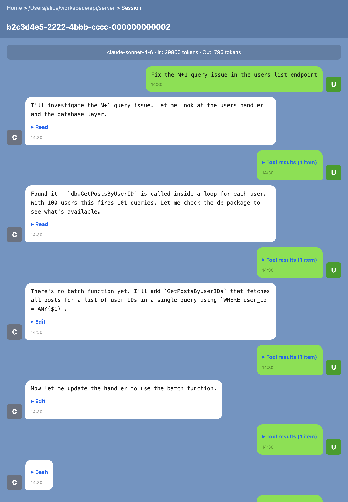
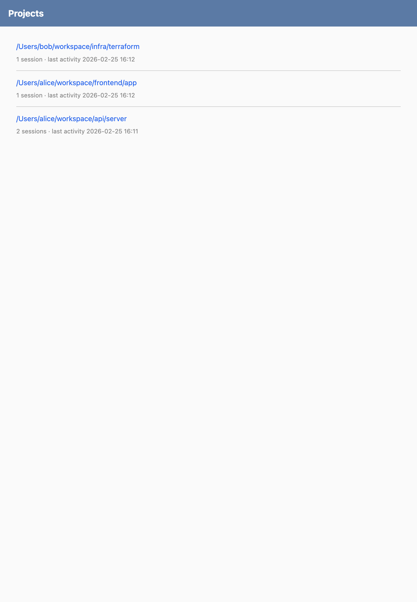
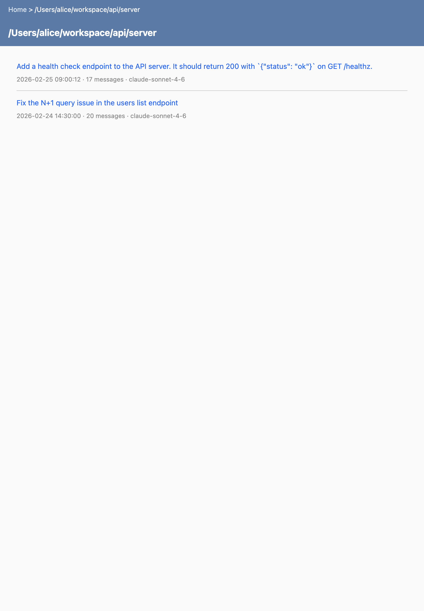

# claude-code-share

A simple HTTP server that reads Claude Code conversation logs (JSONL) and serves them as a browsable web UI for team sharing.



## Install

```bash
go install github.com/nhosoya/claude-code-share@latest
```

Or build from source:

```bash
git clone https://github.com/nhosoya/claude-code-share.git
cd claude-code-share
go build -o claude-code-share .
```

## Usage

```bash
# Start with defaults (port 3333, reads ~/.claude/projects)
./claude-code-share

# Custom port and host
./claude-code-share --port 8080 --host 127.0.0.1

# Custom log directory
./claude-code-share --log-dir /path/to/claude/projects
```

| Flag | Default | Description |
|------|---------|-------------|
| `--port` | `3333` | HTTP server port |
| `--host` | `0.0.0.0` | HTTP server host (LAN-accessible by default) |
| `--log-dir` | `~/.claude/projects` | Path to Claude Code projects directory |

## Screenshots

| Project List | Session List |
|:---:|:---:|
|  |  |

## Development

```bash
go test ./...   # Run tests
gofmt -w .      # Format code
go build .      # Build
```
